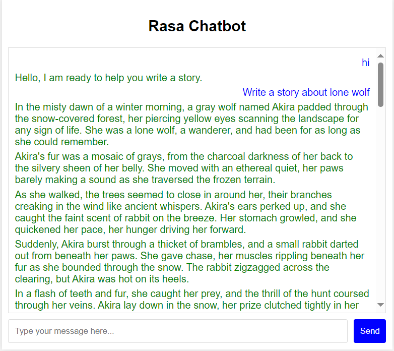

# Інтерактивний чат-бот для генерації історій

## Опис проєкту

Цей проєкт розроблений для створення інтерактивного чат-бота, який генерує історії на основі запитів користувачів. Бот здатен розпочинати нові історії, продовжувати поточні та оновлювати їх за допомогою заданих користувачем параметрів. Для зберігання розмов використовується база даних MySQL. 

## Можливості бота

- Розпізнавання та відповідь на привітання користувачів.
- Генерація нових історій за запитами користувачів.
- Продовження та оновлення існуючих історій.
- Збереження розмов в базу даних після отримання дозволу від користувача.
- Відображення зображень, якщо це потрібно для відповіді бота.

## Вимоги до системи

- Python 3.7 або вище
- MySQL
- RASA
- Groq API

## Встановлення

### Крок 1: Клонування репозиторію

```bash
git clone https://github.com/BocchiTheProg/InteractiveStoryGeneratingChatBot
```

### Наступні етапи встановлення краще виконувати у віртуальному середовищі (venv)

### Крок 2: Встановлення RASA

```bash
pip3 install rasa
```

### Крок 3: Встановлення mysql-connector

```bash
pip3 install mysql-connector
```

### Крок 4: Встановлення Groq API

```bash
pip install groq
```
P.S. Не забудьте встановити змінну середовища GROQ_API_KEY з вашим ключем від Groq API

## Створення моделі (її навчання)

- Переходимо в папку Bot та в ній створюємо директорію ***models***
- Знаходячись в папці Bot, з термінала виконуємо наступну команду 

```bash
rasa train
```
- Чекаємо на завершення, після чого архів моделі з'явиться у створеній папці

## Запуск

### Крок 1: Запуск спеціальних дій

Переходимо в папку Bot проєкту та з неї в терміналі виконуємо наступну команду

```bash
rasa run actions
```

### Крок 2: Запуск RASA сервера

З іншого терміналу, з тієї ж папки, виконуємо наступну команду

```bash
rasa run --enable-api --cors "*"
```

### Крок 3: Запуск локального сервера

З іншого терміналу, повертаючись до кореневої папки проєкту (де знаходиться файл index), виконуємо наступну команду

```bash
 python -m http.server
```

### Крок 4: Спілкуємось з ботом

Заходимо в браузер та переходимо за наступною веб-адресою

```bash
 localhost:8000
```

Після цього маємо побачити діалогове вікно для розмови.


